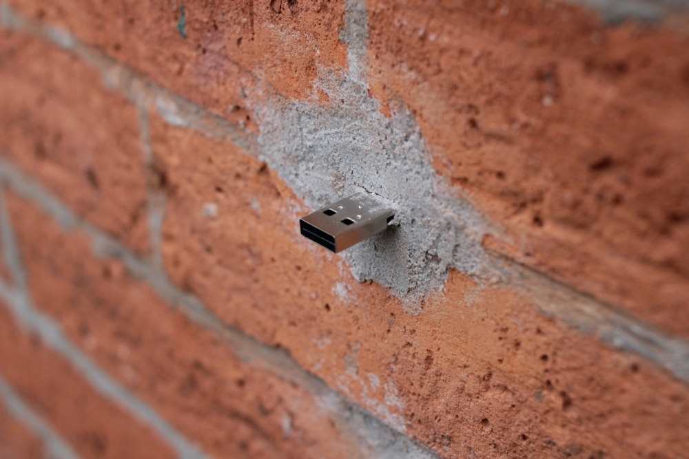

# LambdaCalculus's PirateBox Project
Keeping documentation of my PirateBox project in one place while I work on it

## About This Project

I've been inspired by the current states of politics in the US, especially
with book bannings, anti-LGBTQ bills, lack of education, and lack of
resources getting into people's hands. I have wanted to build an off-grid,
easy to carry mesh networked, low powered device to various places, allow
people to hop onto its mesh network, and access books, videos, knowledge,
and be able to further share that with others.

Inspiration for this project has come from various sources, all linked
below.

1. The original Pirate Box project, sadly no longer active [but full of good ideas](https://piratebox.cc/start).
2. Hackaday's tagged "dead drop" articles, [which is what a Pirate Box is in essence](https://hackaday.com/tag/dead-drop/).
3. A SubStack post by [HydroponicTrash](https://kolektiva.social/@hydroponictrash) describing their own build of a Pirate Box, along with their
software stack, which is where I got some of the ideas for this project
from; their article can be read [here](https://anarchosolarpunk.substack.com/p/offgridinternet).
4. The [Dead Drops website](https://deaddrops.com/), which describes dead drops in detail (a Pirate Box is similar in concept to a Dead Drop).
5. And, of course, the hacking community as a whole!

## What Is This Repo For?

While I want to document the project and all of its steps, this repo will
not only serve as a documentation, but also as a means of making your own
Pirate Box as well. I'll list materials, software stacks, and other needed
information in other documents in this repo, and, where possible, offer
the needed torrent files or URLs to gather up the various materials I
included with mine. However, you don't have to follow mine 1:1 if you don't
want to; the beauty of this project is you can offer up anything you wish!

## What is a Pirate Box, anyway?

Pirate Boxes are meant to create a wireless, off-grid network that can be
designed for several purposes: **anonymous file sharing**, **chatting**,
**hosting a message board**, and **media streaming** among those purposes.
Its main goal is to provide the following (taken from the original
[Pirate Box goals page](https://piratebox.cc/goals)):

1. Easy file sharing and media streaming
2. Respect for the public and to raise awareness about online censorship,
surveillance, and freedom of speech
3. Complete respect of privacy; Pirate Boxes should not collect access or
connection logs of any sort from the users
4. Education; Pirate Boxes can teach about computer programming and how a
computer network functions
5. An open network (AP), using open networking standards

TL;DR, a single board computer (SBC) can be used to build a simple, portable
mesh network you can carry around for any of the purposes above, or even
other purposes you can think of! Don't just limit yourself to what I'm
building mine for; have fun and experiment! Explore! Create! Share!

## You mentioned Dead Drops, too?

Yup, I did! ***Dead Drops*** are a similar concept, but executed
just slightly differently. While a Pirate Box is a mesh networked box,
a Dead Drop is usually a USB drive, often embedded into a wall, building,
or curbside, and accessible in a public space. People are encouraged
to grab from and share to a dead drop; grab some files, leave some files.

However, Dead Drops have a few differences compared to a Pirate Box:

- Unlike a Pirate Box, a Dead Drop is completely offline, and is often
***just*** the USB drive only. This makes it much easier to hide somewhere
and be less conspicuous.
- Dead Drops can, unfortunately, be used for malicious purposes. Someone
can be an asshole and leave files infected with viruses or malware on one,
potentially causing harm to other people's laptops. While a rare occurance,
it's best to not use your main laptop for accessing a Dead Drop.

If you're interested in learning more about Dead Drops, here's a
[great site](https://deaddrops.com/) that shows the beginning of a few
planted around New York City.